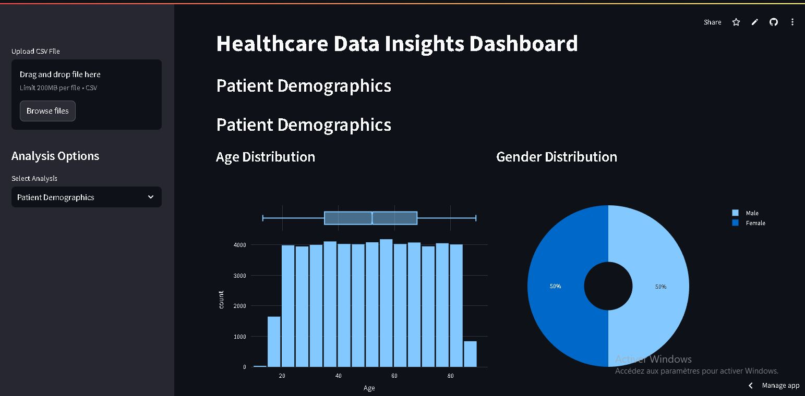
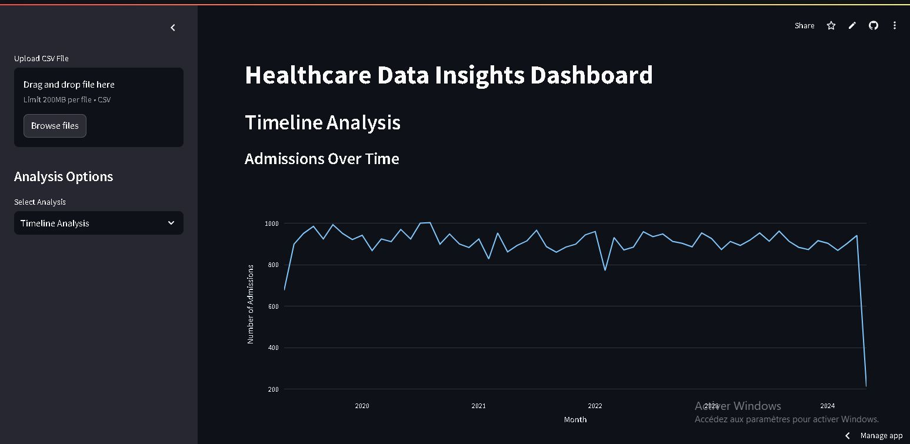
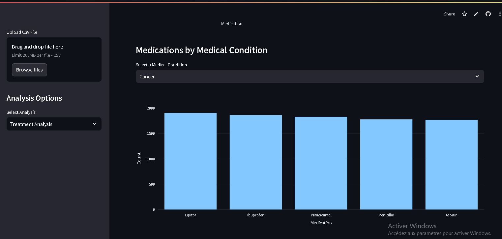

# **Healthcare Data Insights App**

This Streamlit application provides interactive visualizations and analyses of healthcare data. It includes modules for demographic, timeline, and treatment analysis, enabling users to explore patterns and gain insights from healthcare datasets.

---
## **Live Demo**

The application is live! Check it out here:  
[Healthcare Data Insights App](https://healthcare-data-insights-project-nmt6hvguokpvmhdx9knm49.streamlit.app)

---
## **Features**

- **Demographic Analysis**:  
  Analyze the distribution of patient demographics, including age, gender, and medical conditions.  
  - Histogram and count plots for in-depth exploration.
  - Gender-based comparisons.

- **Timeline Analysis**:  
  Visualize trends in hospital admissions and discharges over time.  
  - Time-series plots to identify seasonal or yearly patterns.

- **Treatment Analysis**:  
  Examine the distribution of medications, test results, and medical conditions.  
  - Word clouds for medication frequency.
  - Insights into test result trends.

---

## **Technologies Used**

- **Frontend**:  
  - [Streamlit](https://streamlit.io/) for building the interactive web application.

- **Visualization**:  
  - [Seaborn](https://seaborn.pydata.org/)  
  - [Matplotlib](https://matplotlib.org/)  
  - [Plotly](https://plotly.com/)  
  - [WordCloud](https://github.com/amueller/word_cloud)  

- **Data Handling**:  
  - [Pandas](https://pandas.pydata.org/)

---

## **Installation**

1. Clone the repository:  
   ```bash
   git clone https://github.com/your-username/healthcare-data-insights.git
   cd healthcare-data-insights

2. Clone the repository:  
   ```bash
   pip install -r requirements.txt
3. Run the app:  
   ```bash
   streamlit run app_2.py


## **Deployment**  
**The app is deployed on Streamlit Cloud. You can view it live here.**
- The app uses a synthetic healthcare dataset (healthcare_data.csv) for demonstration purposes.
- Columns include:
 Name, Age, Gender, Medical Condition, Date of Admission, Discharge Date, Medication, etc.
## **Dataset**

The app uses a synthetic healthcare dataset (`healthcare_data.csv`) for demonstration purposes.  
Columns include:  
- `Name`, `Age`, `Gender`, `Medical Condition`, `Date of Admission`, `Discharge Date`, `Medication`, etc.

---

## **How to Use**

1. Upload a CSV file containing healthcare data.  
2. Navigate between tabs:
   - **Demographic Analysis**
   - **Timeline Analysis**
   - **Treatment Analysis**
3. Explore insights through interactive plots and visualizations.

---

## **Screenshots**

### Demographic Analysis  


### Timeline Analysis  


### Treatment Analysis  


---

## **Contributing**

Contributions are welcome! To contribute:  
1. Fork the repository.  
2. Create a new branch for your feature/bug fix.  
3. Submit a pull request.

---

## **License**

This project is licensed under the [MIT License](LICENSE).


